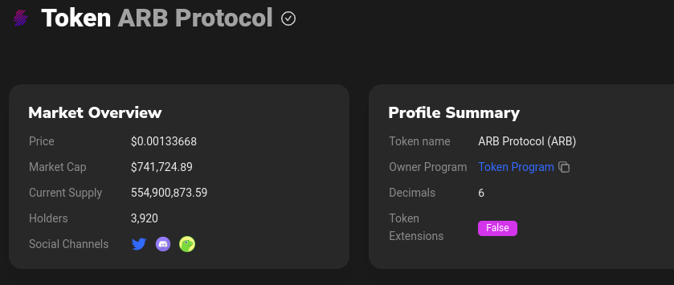

# baseConfig.json

`decimals`: you can find the decimals for your token by going to your token's [birdeye page](https://birdeye.so/token/9tzZzEHsKnwFL1A3DyFJwj36KnZj3gZ7g4srWp9YTEoh?chain=solana). Click on the address and it should take you to the token's [Solscan page](https://solscan.io/token/9tzZzEHsKnwFL1A3DyFJwj36KnZj3gZ7g4srWp9YTEoh) where it should show you the decimals.\
&#x20;


```json
[
    {
      "mint": "So11111111111111111111111111111111111111112",
        "name": "SOL",
      "decimals": 9,
      "enabled": false,
      "minTradeSize": 0.01,
      "maxTradeSize": 0.1,
      "balance": 0.25,
      "tradeSizeDecimals": 2,
      "minProfitBps": 100,
      "directRoutesOnly": false
    }
]
```
