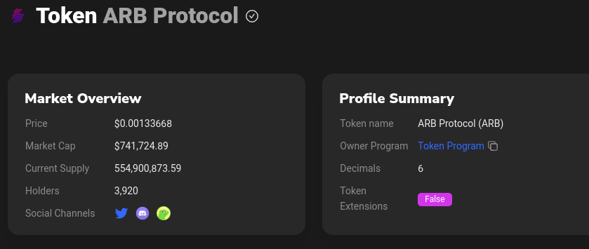

# baseConfig.json

`decimals`: you can find the decimals for your token by going to your token's [birdeye page](https://birdeye.so/token/9tzZzEHsKnwFL1A3DyFJwj36KnZj3gZ7g4srWp9YTEoh?chain=solana). Click on the address and it should take you to the token's [Solscan page](https://solscan.io/token/9tzZzEHsKnwFL1A3DyFJwj36KnZj3gZ7g4srWp9YTEoh) where it should show you the decimals.\
&#x20;

`minProfitBps`: your minimum profit threshold in basis points. For example, if you set this to 100 bps (1%), the bot will not attempt a transaction for the opportunities it finds under 100 bps profit. The bot is constantly searching for opportunities for a random trade size fixed in the min max range you provide. When it finds an opportunity, for example, swapping 100 usdc for 101 usdc. This is a 1% profit or 100 BPS (basis points). In this example if your minProfitBps = 99 then the bot will not attempt the arb txn.

`directRoutesOnly`: will only look for direct routes, for example:\
(SOL -> TOKEN, TOKEN -> SOL)\
Pros: transactions will be lighter and more likely to land\
Cons: you will see less opportunities

`tradeSizeDecimals`: the number of decimals for the base token amount. E.g., if minTradeSize = 1 and max = 4, tradeSizeDecimals = 2, then the bot will look for arb opportunities with trade sizes like 1.69, 4.20, etc.

`maxAccounts`: read [here](https://station.jup.ag/docs/apis/swap-api#using-maxaccounts). maxAccounts is a param for each quote request and each arb requests 2 quotes. Transactions cannot have more than 64 accounts, so don't make the maxAccounts value higher than 32. I use 28 for this value.

`profitBpsThresholdForSim`: in an effort to save on transaction fees, you can ask to simulate the transaction before sending to the blockchain. Ideally, the simulation catches what would be failed (nonprofitable) transactions and doesn't attempt to send them and therefore you don't pay a transaction fee. The catch is that this would make a valid/profitable transaction slightly slower and you may miss opportunities. This value[^1] is an upper bound profitBps value that determines whether the bot will attempt a simulation before attempting to broadcast your transaction to the chain. If your profitBpsThresholdForSim = 110 and the discovered arb opportunity has a profitBps = 100 then the bot will attempt to simulate because the profitBps 100 < 110 (sim value).

If profit < value, then simulate the transaction before sending. The idea here is to not waste time simulating if the opportunity has a high profit bps but it's also nice to not waste txn fee sol on a txn that would have failed if sent to chain.

`min/maxFeeLamports`: min/max priority fees based on potential profit scaled for 3% as max. So if the potential profit for an arb is >= 3% then the maxFeeLamports will be used. And then everything between 0% - 3% potential profit scales linearly. I think this would do better scaling exponentially. Will need to look into this.

`jitoProfitPerc`: Percent of profit to send as a jito bundle tip. E.g., if the value is set to 50 then every profitable transaction will send 50% of the profit as a jito tip in SOL. Jito tips are only in native SOL so make sure you have enough SOL to use this.

This only works with SOL/USDC/USDT workers. Keep this value = 0 otherwise.

When this value = 0 , normal transactions will be used. Not a jito bundle.

When this is > 0 the worker will **only** send your transactions in a jito bundle.

`maxTipLamports`: the max tip allowed for a Jito tip. For example, if your Jito bundle transaction is going to profit 1 SOL and your jitoProfitPerc = 50% then the bot will normally tip 0.5 SOL but if your maxTipLamports value is 0.10 SOL (in lamports) then the bot will tip 0.10 SOL and you will earn 0.4 SOL more profit. You can use this website to convert SOL to lamports: [https://www.solconverter.com/](https://www.solconverter.com/)

`useHeliusTxn and heliusPriorityLevel`: please read about these properties [here](https://github.com/AlexRubik/rude-bot-solana/releases/tag/v1.0.0-alpha).

\
Please refer to [Strategies](../strategies.md) after learning about the baseConfig.json properties.

```json
[
    {
      "workerUniqueId": "wsol5",
      "mint": "So11111111111111111111111111111111111111112",
        "name": "SOL",
      "decimals": 9,
      "enabled": true,
      "minTradeSize": 0.006,
      "maxTradeSize": 0.22,
      "balance": 10.25,
      "tradeSizeDecimals": 5,
      "minProfitBps": 4,
      "directRoutesOnly": false,
      "maxAccounts": 20,
      "profitBpsThresholdForSim": 1,
      "minFeeLamports": 1000,
      "maxFeeLamports": 3000,
      "jitoProfitPerc": 0,
      "minTipLamports": 0,
      "maxTipLamports": 10000000,
      "useHeliusTxn": true,
      "heliusPriorityLevel": "MEDIUM",
      "includeMintsJsonPath": "./includeMints.json"
    }
]
```

[^1]: profitBpsThresholdForSim
